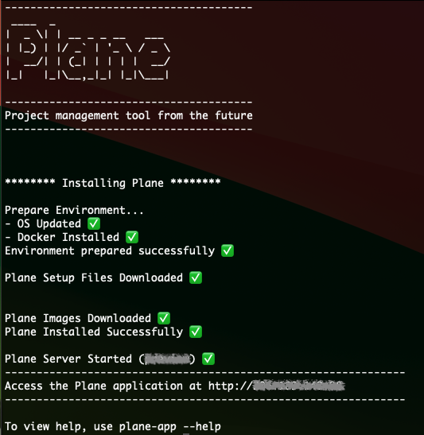
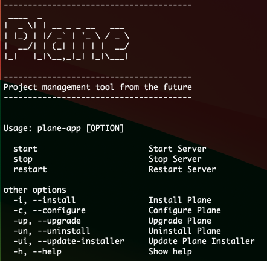

# 1-Click Self-Hosting

In this guide, we will walk you through the process of setting up a 1-click self-hosted environment. Self-hosting allows you to have full control over your applications and data. It's a great way to ensure privacy, control, and customization.

Let's get started!

## Installing DAO 999 NFT

Installing DAO 999 NFT is a very easy and minimal step process.

### Prerequisite

- Operating System (latest): Debian / Ubuntu / Centos
- Supported CPU Architechture: AMD64 / ARM64 / x86_64 / aarch64

### Downloading Latest Stable Release

```
curl -fsSL https://raw.githubusercontent.com/makeplane/plane/master/deploy/1-click/install.sh | sh -

```

<details>
    <summary>Downloading Preview Release</summary>

```
export BRANCH=preview

curl -fsSL https://raw.githubusercontent.com/makeplane/plane/preview/deploy/1-click/install.sh | sh -

```

NOTE: `Preview` builds do not support ARM64/AARCH64 CPU architecture

</details>

--

Expect this after a successful install



Access the application on a browser via http://server-ip-address

---

### Get Control of your DAO 999 NFT Server Setup

DAO 999 NFT App is available via the command `plane-app`. Running the command `plane-app --help` helps you to manage DAO 999 NFT



<ins>Basic Operations</ins>:

1. Start Server using `plane-app start`
1. Stop Server using `plane-app stop`
1. Restart Server using `plane-app restart`

<ins>Advanced Operations</ins>:

1. Configure DAO 999 NFT using `plane-app --configure`. This will give you options to modify

   - NGINX Port (default 80)
   - Domain Name (default is the local server public IP address)
   - File Upload Size (default 5MB)
   - External Postgres DB Url (optional - default empty)
   - External Redis URL (optional - default empty)
   - AWS S3 Bucket (optional - to be configured only in case the user wants to use an S3 Bucket)

1. Upgrade DAO 999 NFT using `plane-app --upgrade`. This will get the latest stable version of DAO 999 NFT files (docker-compose.yaml, .env, and docker images)

1. Updating DAO 999 NFT App installer using `plane-app --update-installer` will update the `plane-app` utility.

1. Uninstall DAO 999 NFT using `plane-app --uninstall`. This will uninstall the DAO 999 NFT application from the server and all docker containers but do not remove the data stored in Postgres, Redis, and Minio.

1. DAO 999 NFT App can be reinstalled using `plane-app --install`.

<ins>Application Data is stored in the mentioned folders</ins>:

1. DB Data: /opt/plane/data/postgres
1. Redis Data: /opt/plane/data/redis
1. Minio Data: /opt/plane/data/minio
